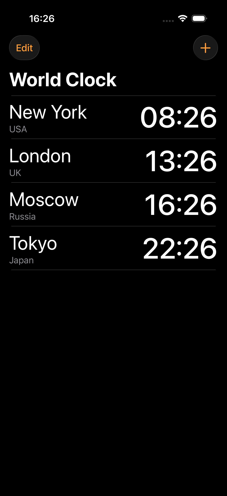
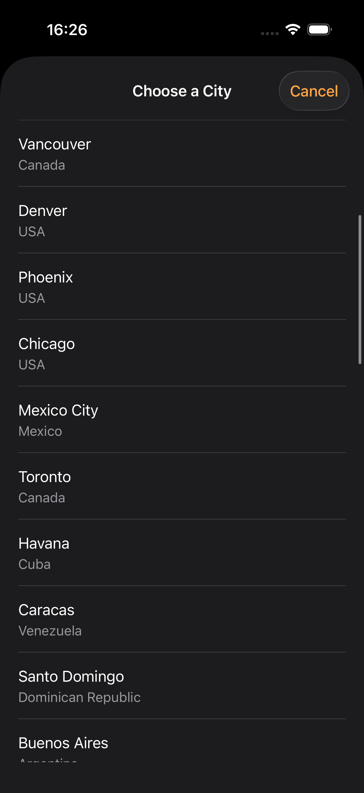
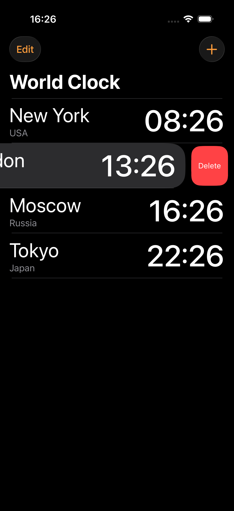
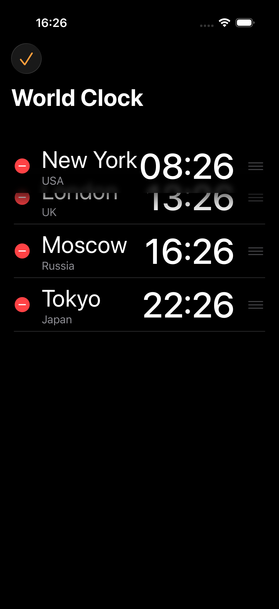

# World Clock - Мировые часы

## Описание проекта

Учебное iOS-приложение для отображения текущего времени в различных городах мира. Приложение позволяет пользователю выбирать города из списка и отслеживать время в выбранных локациях в режиме реального времени.

## Задача

Создать приложение, которое:
- Использует структуру `City` для представления информации о городах (название и часовой пояс)
- Содержит массив объектов `City`, представляющих разные города мира
- Отображает текущее мировое время для каждого выбранного города
- Форматирует время в формате "HH:mm:ss" с учетом часового пояса каждого города

## Решение

### Архитектура

Проект реализован с использованием архитектуры MVC (Model-View-Controller):

- **Models**: 
  - `City` - структура для представления города (название, страна, идентификатор часового пояса)
  - `DataStore` - класс для хранения и управления данными о городах

- **ViewControllers**:
  - `WorldClockViewController` - главный экран с таблицей выбранных городов
  - `SelectCityViewController` - экран выбора нового города для добавления

- **Views**:
  - `WorldClockTableViewCell` - кастомная ячейка для отображения города и времени

### Основной функционал

1. **Отображение времени**: Используется `DateFormatter` с установкой `timeZone` для корректного отображения времени каждого города
2. **Обновление в реальном времени**: `Timer` обновляет время каждую секунду
3. **Управление городами**: 
   - Добавление новых городов через модальный экран выбора
   - Удаление городов через swipe-to-delete
   - Переупорядочивание городов через drag-and-drop
4. **Начальные данные**: По умолчанию отображаются 4 города: New York, London, Moscow, Tokyo

### Технические детали

- Время форматируется с помощью `DateFormatter` с учетом часового пояса через `TimeZone(identifier:)`
- Используются стандартные идентификаторы часовых поясов IANA (например, "America/New_York", "Europe/Moscow")
- Приложение содержит расширенный список из 50+ городов для выбора

## Стек технологий

- **Язык**: Swift
- **Фреймворки**: 
  - UIKit - для построения пользовательского интерфейса
  - Foundation - для работы с датами, временем и часовыми поясами
- **Паттерны**: MVC, Delegate Pattern

## Особенности реализации

- Автоматическое обновление времени каждую секунду
- Поддержка большого количества городов (50+)
- Интуитивный пользовательский интерфейс с навигацией
- Возможность редактирования списка городов (добавление, удаление, переупорядочивание)

## Скриншоты

<table>
  <tr>
    <td style="border: none;"></td>
    <td style="border: none;"></td>
    <td style="border: none;"></td>
    <td style="border: none;"></td>
  </tr>
</table>
